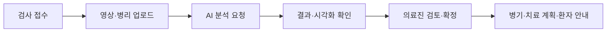
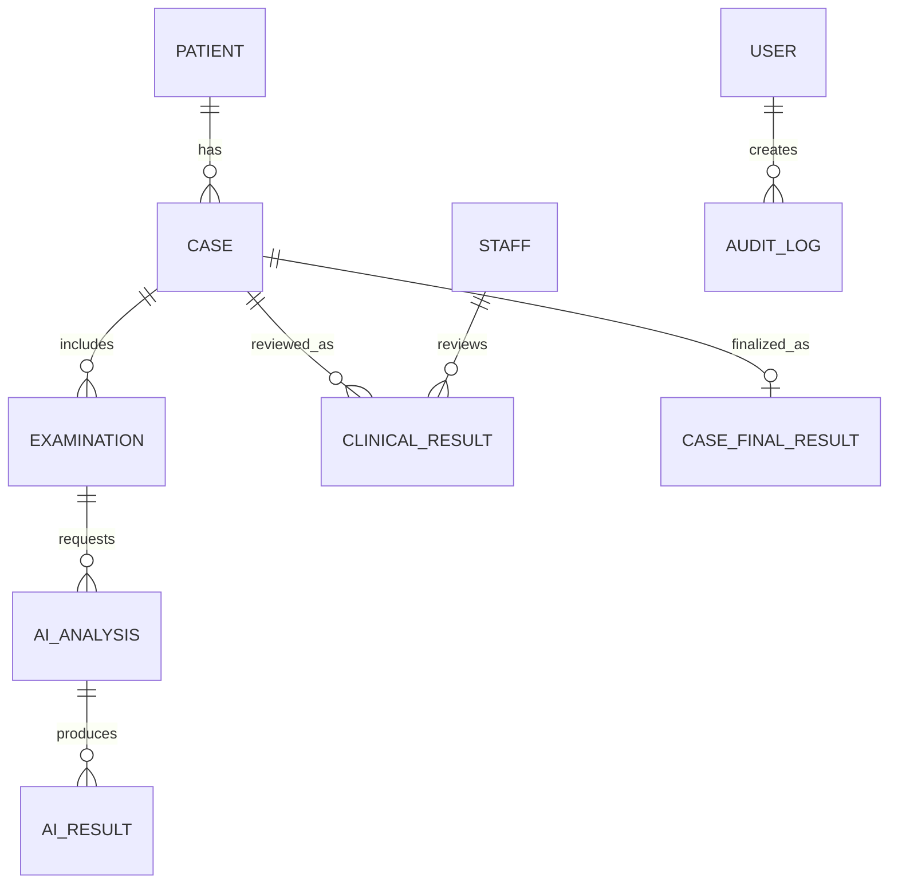
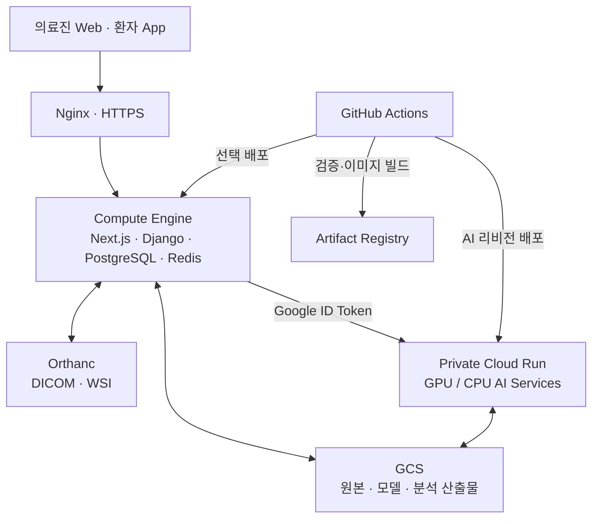

# 🫁 SoomIT

<p align="center">
  <strong>폐암 진단부터 치료 계획까지 연결하는 임상 의사결정지원시스템</strong><br />
  X-ray · CT · PET-CT · WSI · PD-L1 분석 결과를 케이스 중심으로 통합합니다.
</p>

<p align="center">
  
  
  
  
  
</p>

> [!IMPORTANT]
> SoomIT의 AI 결과는 의료진의 검토를 돕는 **후보 결과**입니다. 확정 진단·병기·처방은 의료진 검토 및 승인 흐름을 거쳐 관리합니다.

## ✨ Why SoomIT?

폐암 진료는 영상 검사, 병리 판독, 바이오마커, TNM 병기, 치료 계획이 순차적으로 이어집니다. 하지만 결과가 여러 시스템과 파일에 흩어지면 이전 검사 결과를 다시 확인하고 다음 단계로 연결하는 데 시간이 듭니다.

SoomIT은 분산된 데이터를 케이스 단위로 묶고, 각 분석 결과를 **원본 영상·시각화 근거·의료진 검토 상태**와 함께 제공합니다.



## 🧭 서비스 한눈에 보기

| 사용자 | 주요 경험 |
| --- | --- |
| 원무·코디네이터 | 환자 등록, 예약·검사 일정 관리, 케이스 진행 상태 확인 |
| 영상의학과 | X-ray/CT 검사 등록, DICOM 뷰어 확인, AI 분석 요청 및 결과 확인 |
| 병리과 | WSI 등록·주석, 조직/유전자·PD-L1 분석 요청, 근거 이미지 검토 |
| 호흡기내과 | 여러 검사 결과 통합, TNM 후보·치료 정보 확인, 최종 승인 |
| 환자 | 예약·검사·복약 정보 확인, 건강 챗봇·알림·주변 의료기관 기능 |

### 핵심 기능

| 🩻 멀티모달 분석 | 🔎 근거 중심 뷰어 | 🩺 검토 기반 워크플로우 |
| --- | --- | --- |
| X-ray, CT, PET-CT, WSI, PD-L1 결과를 하나의 케이스로 연결 | DICOM, CT 3D, WSI 어텐션·주석을 결과와 함께 확인 | AI 제안과 의료진 확정 결과를 분리해 추적 |
| 💊 치료·처방 지원 | 💬 지식 기반 챗봇 | 🔔 실시간 협업·알림 |
| 치료 조합, DUR·HIRA 연계 정보, 처방 안전성 검토 | RAG·MCP로 검색된 근거를 기반으로 환자 질문 지원 | 케이스 채팅, 상태 변경, 예약·복약 알림 |

---

## 🖥️ Frontend — 역할별 임상 워크스페이스

`frontend/`는 Next.js App Router 기반의 의료진 웹입니다. 하나의 대시보드에 모든 기능을 몰아넣기보다, 부서별 실제 업무 순서에 맞춰 화면과 권한을 분리했습니다.

| 화면 영역 | 핵심 기능 | 주요 라이브러리 |
| --- | --- | --- |
| 코디네이터 | 환자·케이스·예약 관리, 진행 현황, 부서 간 의뢰 | Next.js, React, TypeScript |
| 영상의학과 | 검사 worklist, DICOM 시리즈, X-ray/CT AI 결과, 완료 이력 | Cornerstone3D, DICOM parser |
| 병리과 | WSI 뷰어, 주석 레이어, 조직/유전자·PD-L1 결과 확인 | OpenSeadragon |
| 호흡기내과 | 케이스 타임라인, AI 요약, TNM·치료·처방·의견·지식 검색 | React, Tailwind CSS |
| 시스템·병원 관리자 | 병원·사용자·역할·부서 관리 | 역할별 콘솔 UI |

### 의료 영상과 결과를 함께 보는 UI

- **CT/DICOM**: Cornerstone3D 기반 다중 단면 뷰어와 분할 mask·labelmap overlay
- **CT 3D**: Three.js 기반 결절·해부학 GLB 레이어 시각화
- **WSI**: OpenSeadragon 기반 고해상도 슬라이드 탐색, 병리 주석·어텐션 근거 표시
- **케이스 워크스페이스**: 검사 결과, AI 요약, 의료진 의견, 승인 상태를 같은 맥락에서 확인

```text
frontend/src/
├── app/                 # 역할·업무 영역별 라우트
│   ├── coordinator/     # 환자·예약·케이스 조정
│   ├── radiology/       # 영상의학과 worklist·AI·DICOM
│   ├── pathology/       # WSI·PD-L1 워크스테이션
│   ├── respiratory/     # 호흡기내과 케이스·치료·처방
│   ├── hospital-admin/  # 병원 관리자
│   └── system-admin/    # 시스템 관리자
├── components/          # viewer, workspace, auth, UI 공통 컴포넌트
├── features/            # 도메인 단위 기능 모듈
├── hooks/ · lib/        # API 호출, 상태·표시 로직
└── types/               # 공유 타입
```

---

## ⚙️ Backend — 케이스 중심 도메인 API

`backend/`는 Django REST Framework 기반 API입니다. 단순히 AI 서비스의 프록시가 아니라, 사용자·권한·검사·분석·임상 의사결정의 상태를 관리하고 각 단계를 연결합니다.

| 도메인 | 책임 |
| --- | --- |
| `accounts` | 병원·부서·직원 계정, 역할 기반 권한, 관리자 프로비저닝 |
| `patients` · `scheduling` | 환자 프로필, 주소·예약·검사 일정, 환자 앱 API |
| `cases` · `radiology` · `pathology` | 케이스 생성, 검사 오더, Orthanc/GCS 연동, 영상·WSI 워크플로우 |
| `ai_results` | AI 분석 요청 상태, 모델 버전, 원본 AI 결과 관리 |
| `clinical` | TNM·임상 결과, 치료 조합, 처방·안전성 검토 |
| `annotations` | 의료 영상·병리 주석 저장 |
| `chat` · `notifications` | 케이스 채팅, 읽음 상태, 예약·검사·복약 알림 |
| `knowledge` | pgvector 기반 의료 지식 검색 API |
| `audit` | 주요 접근·변경 이력 관리 |

### 데이터 설계 원칙



- **AI 결과와 의료진 최종 결과를 분리**해 원본 모델 응답과 임상 판단을 혼동하지 않음
- 대용량 DICOM·WSI·모델 가중치·시각화 산출물은 Orthanc/GCS에 저장하고, DB에는 참조 URI·상태·메타데이터를 저장
- JWT 인증, 페이지 라우팅 가드, Django permission class를 통해 역할별 화면·API 접근을 제어
- Celery와 Redis를 통해 분석 요청·알림·예약 관련 비동기 작업을 처리

---

## 🤖 AI 모델과 성능

<details>
<summary><strong>X-ray · CT</strong></summary>

| 영역 | 최종 구성 | 역할 | 확인된 지표 |
| --- | --- | --- | --- |
| X-ray 분류 | `swin_base_patch4_window7_224` | Normal / Other Lung Disease / Suspicious Lung Cancer 3분류 | 배포 모델 성능 수치는 별도 검증 리포트 관리 |
| X-ray 탐지 | `fasterrcnn_resnet50_fpn_v2` | 13개 흉부 이상 소견 bounding box·점수 | 운영 API 응답 검증 완료 |
| CT 결절 탐지 | CPMNetv2 + Hard Negative 25% | 1 mm 전처리, 결절 후보 탐지, 좌표 변환 | Validation CPM **0.712925** |
| CT Phase 1 | VISTA3D + Med3D + TotalSegmentator | 분할·정량화·형태·질감·악성도·해부학 분석 | 악성도 Test ROC-AUC **0.8782**, Sensitivity **0.8902** |

</details>

<details>
<summary><strong>PET-CT · TNM</strong></summary>

| 구성 | 최종 모델 | 역할 |
| --- | --- | --- |
| T | nnU-Net Dataset504 | 원발 종양 mask 및 크기 기반 후보 |
| N | CatBoost-N | CT Phase 2의 34개 특징으로 N 후보 |
| M | nnU-Net Dataset502 + CatBoost-M + rule engine | PET-CT 병변·해부학 중첩 기반 M 후보 |

TNM 결과는 의료진 확인 전 확정 병기가 아닌 **검토 후보**로 관리합니다.

</details>

<details>
<summary><strong>WSI 조직·유전자</strong></summary>

| 과제 | 비교 | 최종 선택 | 성능 |
| --- | --- | --- | --- |
| 조직/아형 분류 | AMD-MIL vs. CLAM, 공통 UNI2-h backbone | Gated Attention CLAM + UNI2-h | Test Accuracy **95.16%** (AMD-MIL 94.12%) |
| 유전자 변이 가능성 | AMD-MIL vs. CLAM, LUAD 전용 | Gated Attention CLAM + UNI2-h | Mean Test AUC **0.6969** (AMD-MIL 0.6652) |

WSI는 0.5 MPP·256×256 타일·최대 10,000패치의 고정 전처리 계약을 사용합니다. 실제 8,597패치 요청에서 UNI2-h GPU 임베딩 시간은 99.712초로 측정됐으며, TensorRT 최적화 우선 후보로 관리합니다.

</details>

<details>
<summary><strong>PD-L1</strong></summary>

| 항목 | 내용 |
| --- | --- |
| 최종 구성 | Virchow2 특징 추출기 + AMD-MIL |
| 입력 | PD-L1 IHC WSI + HALO 종양 ROI annotation |
| 출력 | TPS `<1%` / `1–49%` / `≥50%`, 신뢰도, 전처리 정보 |
| 최종 테스트 | Macro F1 **0.8611**, Macro AUROC **0.9567**, Accuracy **0.8750** |

실제 76패치 요청에서 Virchow2 특징 추출은 2.873초였습니다. 더 큰 ROI의 반복 측정 후 TensorRT 적용 여부를 판단합니다.

</details>

### 모델 서빙 최적화

- CT Phase 1: VISTA3D를 요청마다 생성하지 않고 서버 시작 시 1회 초기화
- CT Phase 1: 운영 로그상 평균 처리 시간이 246.442초 → 220.913초로 약 **10.4% 감소**
- TNM-M: nnU-Net의 CPU↔GPU 이동 시간을 분리 기록하고, 기본 offload 정책으로 TotalSegmentator와의 OOM 위험 관리
- 병리·PD-L1: 다운로드, 패치 처리, GPU 추론, 후처리 시간을 분리 로그로 기록해 TensorRT 적용 가능성 검증

> 운영 로그 기반 시간은 입력 크기와 cold start 영향을 받습니다. 모델 정확도와 추론 최적화 성능은 별도 지표로 관리합니다.

---

## 🏗️ 아키텍처와 배포



### 변경 범위 기반 CI/CD

| 변경 경로 | 자동 검증 | 배포 대상 |
| --- | --- | --- |
| `frontend/` | ESLint, Next.js build | Web이 포함된 VM |
| `backend/` | Django check, migration dry-run, test, Docker build | API가 포함된 VM |
| `realtime/` | 컴파일, 테스트, Docker build | Realtime 서비스 |
| `infra/` | Docker Compose, Nginx 설정 검증 | 인프라 설정 |
| `ai-services/` | 변경 서비스만 matrix 문법·Dockerfile 검증 | 해당 Cloud Run 서비스 |

- `main`: CI 검증 기준 브랜치
- `production`: 검증된 변경의 자동 배포 브랜치
- AI 컨테이너: commit SHA 기반 이미지 태그로 버전 추적
- Cloud Run: 비공개 서비스·서비스 계정 호출·GCS SHA-256 아티팩트 검증
- GPU 서비스: 기본 `min-instances=0`으로 유휴 비용 제어

---

## 🧰 Tech Stack

| Layer | Technologies |
| --- | --- |
| Web | Next.js 16, React 19, TypeScript, Tailwind CSS |
| Mobile | Flutter |
| API | Django 5, Django REST Framework, Simple JWT |
| Realtime / Async | FastAPI, WebSocket, Redis Pub/Sub, Celery |
| Data | PostgreSQL, pgvector, Redis, GCS, Orthanc |
| AI | PyTorch, FastAPI, NVIDIA L4, Cloud Run, Gemini/Genkit/MCP |
| Viewer | Cornerstone3D, OpenSeadragon, Three.js |
| DevOps | Docker Compose, Nginx, GitHub Actions, Cloud Build, Artifact Registry |

## 🚀 Quick Start

### Prerequisites

- Node.js 20+
- Python 3.12+
- Docker Desktop
- 각 서비스의 환경 변수 및 접근 권한

### Web

```bash
cd frontend
npm ci
npm run dev
```

### Backend

```bash
cd backend
python -m venv .venv
source .venv/Scripts/activate  # Git Bash on Windows
pip install -r requirements.txt
python manage.py runserver
```

### Quality Checks

```bash
cd frontend && npm run lint && npm run build
cd backend && python manage.py check && python manage.py test
```

> 모델 가중치, API 키, 서비스 계정 키, 실제 환경 변수는 저장소에 포함하지 않습니다. 하위 서비스별 `.env.example`과 README를 참고하세요.

## 📁 Repository Map

```text
SoomIT/
├── frontend/       # 의료진 웹
├── backend/        # 도메인 API·DB·비동기 작업
├── ai-services/    # GPU/CPU AI 추론 서비스
├── realtime/       # 실시간 이벤트 서비스
├── patient_app/    # Flutter 환자 앱
├── infra/          # Docker Compose·Nginx
└── .github/        # CI/CD 워크플로우
```

## 🧑‍💻 Portfolio

인프라·DB·CI/CD·배포와 프론트/백엔드 핵심 구현을 발표 흐름에 맞춰 정리한 문서는 [PORTFOLIO.md](PORTFOLIO.md)에서 확인할 수 있습니다.
